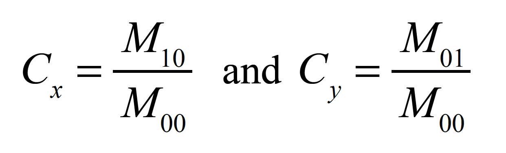

# Non-intrusive eye tracking application in helping paralyzed people communicate

Watch the video:
[](https://youtu.be/6mvg7_E7_cU)


Nowadays, there are diseases that weaken the person to the point of making them totally paralyzed, making them unable to communicate with those persons that are around because perhaps illness or paralysis makes impossible for them to produce sounds. This is why I thought to develop a software which read the movement of their eyes, making these people "autonomous" even if only communicating some of their needs or thoughts. The diseases that inspires me for the realization of this software are mainly the ALS (Amyotrophic Lateral Sclerosis) and the Rett Syndrome. For these, but also for many other pathologies, there are already devices similar to the one proposed in my thesis and in this project that allow communication through eyes movements but these are made available to very few patients or are really expensive.

For this reason, I developed an eye tracking application called ‘EyeHelpYou’ accessible to every person who needs it, also because uses only the computer camera to detect the movement of the eyes. In general, the eye tracking term refers to the process of tracking the eye movements or the absolute point of gaze (POG), that is the point that the user’s gaze is focused on the visual scene. All of the processes performed by the application will be made in real-time, detecting continuously human eyes and extracting eye features from frames captured from the computer camera.
 
In this study, I will propose a non-intrusive gaze tracker software which can detect and track a user’s face, eyes and irises using the data passed from a common webcam available in almost every computer.  A non-intrusive system means that no external device is needed to track the eyes, obviously besides the computer camera which captures the images containing the user face. The system’s face detection is based on Dlib 68 facial landmarks prediction algorithm (shape_predictor_68_face_landmarks). From these landmarks, we will able to detect and extract the user’s eyes regions from the face frame. Once extracted the eyes, applying some thresholding, smoothing, filtering and morphological transformations processes on these areas (all included in the OpenCV library), we will get the center coordinates of the irises that we will use to try to understand in which horizontal direction the user is looking. In simple words, if the user is looking on the left or on the right. Performing an Euclidean norm between the average values of the top and bottom eyelids landmarks coordinate, we will see how the blinking effect could be detected, and evaluate where the eyes are closed or opened. Furthermore, with the same process we can also evaluate when the eyes are dilatated, which means the user is looking up, or when are narrowed, which means that the user is looking down. With these values, we can say in which direction the user is looking and not so accurately say where the user is focusing his gaze.

The application start with a calibration window in order to get and the elaborate the correct center of the irises based on the current computer screen, following and focusing the gaze on 9 points displayed by the software. When the calibration process ends, the keyboard window is displayed and the user will be able to type words moving a cursor with his gaze among all the keyboard tiles. Blinking the eyes for more than 1 second the selected tile will be clicked. Once the user will be ready to convert the text to speech, he will press the microphone button located on the keyboard and the computer will play the voice of what he wrote. This text to speech conversion is performed by the gTTS library (Google Text-to-Speech), a Python library and CLI tool to interface with Google Translate's text-to-speech API. 

> This software was developed as a topic of my degree thesis.

# Application

## 1. Overview

I will show you how the application works and how the user can
interact with it. The application is divided in two windows, the Calibration and the Keyboard ones.

The Calibration window allows the user to calibrate the screen border values using his gaze. In this
window of the application the user, or someone for him, may also adjust and adapt the iris
detection based on the surrounding environment. 

The Keyboard window represents the
main scene of the application. In this window, the user, using his eyes, will interact with the application moving a
cursor among the keyboard tiles and when he will have composed a sentence, blinking his yes, he will press a button to make the computer reproduce the converted text by a voice.

## 2. Calibration Window

Let’s start from the first window which appears when the application is launched.


In the above screenshot of the Calibration Window, it is depicted the way of the
graphic is proposed to the user. In the top side of the window, we have the eyes feedback. Here the
user can see if his eyes are correctly detected and in negative case moves the contrast threshold
slider to adapt the detection on the surrounding environment.

Once the eyes are correctly detected, pressing the button Start Calibration the calibration
process will start. As mentioned before and pictured in the following figure, will be displayed 9
points, one at a time.


Every target point in Figure 4.2 will pass 3 stages. The first one, colored red, means that the
user has to prepare and move is gaze to that point, because it will start store the gaze (x, y) - coordinates
soon. The second stage, colored yellow, means that the application is storing
coordinates. After 15 frames, we had the last stage, colored green, where the application get the
average (x, y) - coordinates from the previous data stored and save them. This 3 stages process
is handled for each of the 9 points needed to find the screen and gaze boundaries to use in the next
window. Once the calibration process terminates, the user may procede to the next window
pressing the Start Application button.

## 3. Keyboard Window

In this last section we will see the main application window, the one which let
the user able to communicate using the computer. In this window the user will move his eyes in
any direction he wants (up, down, left or right) and a cursor will move on the tiles of the keyboard.
The following figure shows the areas where the user has to look to move the cursor up, down, left
or right.


It will be enough for the user to move his gaze in one of these areas and the cursor will follow
it. In case the user will focus his gaze on the center area, the cursor will not move. The movement
of the cursor is performed only if the gaze direction doesn’t change for 7 frames. This means that,
if the user at the sixth frame moves its gaze from left to right, for example, no cursor movement
will be performed.

Detecting if the user eyes are blinking, will help us to know when
the user is keeping his eye close for a certain amount of time. To press the button, the user has to
keep the eyes closed for 5 continuous frames (around 1 second more or less). When the user will
want to reproduce the text, it will be enough to press the microphone button and wait a short time
needed from the gTTS library to convert the text into voice.
Let’s now see how the application window looks like:


In the above screenshot of the Application window, we can see the moment when
the user terminates to compose his sentence and moves the cursor on the microphone button to
start converting text to speech.

# Code Implementation

## 1. Capturing Camera Frames

As first part of this project, we need to capture the face of the person who will use this
software. OpenCV provides a very simple implementation to do this. To capture a video, you need
to create a VideoCapture object. Its argument can be either the device index or the name of a video
file. Device index is just the number to specify which camera. Normally the main camera of the
computer has index 0, but if there are others, it can be select the second camera by passing 1, 2 for
the third one and so on. After that, the application can capture frame-by-frame what camera are
seeing in that moment.

Here an example of the implementation in the application:

```python
import cv2

cap = cv2.VideoCapture(0)

while (True):
    # capture frame by frame
    ret, frame = cap.read()

    # display the resulting frame
    cv2.imshow('frame', frame)

    if cv2.waitKey(1) & 0xFF == ord('q'):
        break;

# when everything done, realease the camera
cap.release()
cv2.destroyAllWindows()
```

As we can see from the code shown above, the variable cap contains the instance of the
camera chose, in our case that of the main computer camera. To capture a continuous flow of the
frames of camera, we capture them inside an infinite loop that will close when the user will decide
it. The function ```cap.read()``` returns two values, the first one is the returned value from the operation
performed by the function and the second one is the camera frame, which I stored into the
homonym variable. The ret variable can assume both True or False values. If the frame is correctly
read, it will be True, otherwise it will be False. The frame variable, instead, will contain the frame
captured by the camera as we can see from the following image:


Let’s focus on this figure. The reader will probably not be noticing that the image is flipped
horizontally because he doesn’t know the orientation of the what is behind my back. To fix this
problem, OpenCV library provides a function, flip(), which allows to flip an image or a video
frame horizontally, vertically, or both. In our case, it will be enough to flip the frame horizontally.

```python
import cv2

cap = cv2.VideoCapture(0)

while (True):
    # capture frame by frame
    ret, frame = cap.read()
    frame = cv2.flip(frame, 1)

    # display the resulting frame
    cv2.imshow('frame', frame)

    if cv2.waitKey(1) & 0xFF == ord('q'):
        break;

# when everything done, realease the camera
cap.release()
cv2.destroyAllWindows()
```

The result of the above code is shown in the next picture and represents the real expectation of the
image orientation.


## 2. Face Region Detection

Since we have seen how to capture camera frames, the next step is to detect the face region
and then, its facial landmarks. They are used to
localize and represent salient regions of the face, such as: eyes, eyebrows, nose, mouth and jawline.

Detecting facial landmarks is a subset of the shape prediction problem. Given an input image,
a shape predictor attempts to localize key points of interest along the shape. In the context of facial
landmarks, our goal is to detect the important facial structures on the face using shape prediction
methods. Detecting facial landmarks is therefore a two steps process, the localization of the face in
the image and then the detection of the key facial structures on the face ROI.

The first step can be achieved in various ways, but in this project it has chosen to apply a pretrained
HOG + Linear SVM object detector specifically for the task of face detection. The actual
algorithm used to detect the face in the image doesn’t matter. Instead, what’s important is that
thanks to some method, we can obtain the face bounding box, that is the (x, y) - coordinates of
the face in the image.

Now that we introduced what technique has been chosen to detect the face in our frames, we
can take a look of how source code works.

```python
import cv2
import dlib
from imutils import face_utils

cap = cv2.VideoCapture(0)

detector = dlib.get_frontal_face_detector()

while (True):
    # capture frame by frame
    ret, frame = cap.read()
    frame = cv2.flip(frame, 1)
        
    r = 800.0 / frame.shape[1]
    dim = (800, int(frame.shape[0] * r))
    
    # resize the frame according to the previous chosen dimension
    frame = cv2.resize(frame, dim, interpolation=cv2.INTER_AREA)
    
    gray = cv2.cvtColor(frame, cv2.COLOR_BGR2GRAY)
    faces_detected = detector(gray, 0)

    for face in faces_detected:
        (x, y, w, h) = face_utils.rect_to_bb(face)
        cv2.rectangle(frame, (x, y), (x + w, y + h), (0, 255, 0), 2)

    # display the resulting frame
    cv2.imshow('frame', frame)

    if cv2.waitKey(1) & 0xFF == ord('q'):
        break;

# when everything done, realease the camera
cap.release()
cv2.destroyAllWindows()
```

As shown in the above snippet of code, we can see how the previous part about capturing frames from camera it is
merged with the one used for face detection. After imported Dlib library, we can use the function
```get_frontal_face_detector()``` to create a detector of all the faces that are present within the image. As
we can notice, after capturing and flipping the frame, I resized it in order to perform the detection
of the face in a lighter and smoother way because this process can heavily increase the application
load, because it will be performed for each frame and not just for one time. A benefit to keep an
high resolution of the frame could be that it may allow us to detect more faces in the image, but
since we need to detect only one person, it is better to decrease the resolution.

Calling the face detector we need to provide him two parameters, the frame and the number of
image pyramid layers. The first parameter, as we said, is our grayscale image (although this
method can work with color images as well), converted in the previous line from BGR color space.
The second parameter is the number of image pyramid layers to apply when upscaling the image
prior to applying the detector.

Given the (x, y) - coordinates of the faces in the image, we can now draw a rectangle to
show if the face is correctly detected, as shown in the next figure.


Now that the face is detected, we move on starting detect key facial structures in the face
region. There are a variety of facial landmark detectors, but all methods essentially try to localize
and label the following facial regions: mouth, right eyebrow, left eyebrow, right eye, left eye, nose
and jawline.

The facial landmark detector starts using a training set of labeled facial landmarks on an image
(shape_predictor_68_face_landmarks.dat). These images are manually labeled, specifying specific
(x, y) - coordinates of regions surrounding each facial structure. The detector exploits priors
approach, or more specifically, the probability on distance between pairs of input pixels.
Given this training data, an ensemble of regression trees are trained to estimate the facial
landmark positions directly from the pixel intensities themselves. The end result is a facial
landmark detector that can be used to detect facial landmarks in real-time with high quality
predictions.

The pre-trained facial landmark detector inside the dlib library is used to estimate the location
of 68 (x, y) - coordinates that map to facial structures on the face. The indexes of the 68
coordinates can be visualized on the image below:


Now that we know these 68 landmarks, we can implement a new part on our code in order to
display them on the face detected.

```python
...
detector = dlib.get_frontal_face_detector()

predictor = dlib.shape_predictor("shape_predictor_68_face_landmarks.dat")

while (True):
    # capture frame by frame
    ret, frame = cap.read()
    frame = cv2.flip(frame, 1)
        
    r = 800.0 / frame.shape[1]
    dim = (800, int(frame.shape[0] * r))
    
    # resize the frame according to the previous chosen dimension
    frame = cv2.resize(frame, dim, interpolation=cv2.INTER_AREA)
    
    gray = cv2.cvtColor(frame, cv2.COLOR_BGR2GRAY)
    faces_detected = detector(gray, 0)

    for face in faces_detected:
        shape = predictor(gray, face)
        shape = face_utils.shape_to_np(shape)
    
        for (x, y) in shape:
            cv2.circle(frame, (x, y), 1, (0, 0, 255), -1)

    # display the resulting frame
    cv2.imshow('frame', frame)

    ...
```

In the above snippet of code, we can see how the facial landmarks are predicted
and then displayed on the face. To better see the exact position of each landmark, I removed from
the code the rectangle part. The landmarks predictor can be initialized calling the function
```shape_predictor()``` included in the Dlib library, that requires only one parameter, the path of the
dataset. Once the predictor is correctly initialized, we can apply for each face found in the frame
captured (in our case only one), the facial landmarks detection providing to the function two
parameters, the grayscale converted frame and the face coordinates. It will return the 68
(x, y) - coordinates that map to the specific facial features in the image. To easily interact with
this output, it’s better to convert it to a simple array (precisely a matrix of 68x2 dimension,
where the two values stay for the (x, y) - coordinates of the detected landmark), with the
function ```shape_to_np()``` provided by the face_utils library included in imutils.
In fact, to display the facial landmarks on the face frame, we use a simple for statement which
draws circles at the exact position predicted before. Running the code, we will get a visual
feedback of the 68 landmarks displayed on the user face:


## 3. Eyes Detection and Extraction

In the previous chapter we have seen how to find and display all the 68 landmarks on the user
face, but as the main goal of the application, we need to extract the eyes regions to detect the eyes
movements. In this chapter, we will see that.
Let’s take a look of the snippets of code that extract the eyes regions:

```python
    ...
    faces_detected = detector(gray, 0)

    if len(faces_detected) > 0:
        face = faces_detected[0]

        # faces points found by dlib library
        landmarks = predictor(gray, face)
        leye_points = [36, 37, 38, 39, 40, 41]
        reye_points = [42, 43, 44, 45, 46, 47]

        leftEye = detectEyeDirection(frame, leye_points, landmarks)
        rightEye = detectEyeDirection(frame, reye_points, landmarks)
        
        cv2.imshow('Left Eye', leftEye)
        cv2.imshow('Right Eye', rightEye)

    # display the resulting frame
    cv2.imshow('frame', frame)

    ...
```

As you may have noticed, the for statement needed to analyze all the faces detected in the
frame captured by the camera, has been substituted with an if statement. This choice has been made
because we need to consider only one face in our application. For this the for stamen is useless.

After we predict the facial landmarks, we set two arrays that stay for both eyes landmarks
identifier. Let’s better explain their meaning with the following figure.


The red points depicted in the above image represents those landmarks
interested in the eye regions detection. ```[36, 37, 38, 39, 40, 41]``` are those useful to detect the left eye
region, whereas ```[42, 43, 44, 45, 46, 47]``` are those useful for the right one. Made this assumptions,
let’s focus our attention on the next snippet code, which will be that one containing the function
needed to extract the eye.

```python
def detectEyeDirection(frame, eye_points, facial_landmarks):
    eye_region = np.array([(facial_landmarks.part(eye_points[0]).x, facial_landmarks.part(eye_points[0]).y),
                                (facial_landmarks.part(eye_points[1]).x, facial_landmarks.part(eye_points[1]).y),
                                (facial_landmarks.part(eye_points[2]).x, facial_landmarks.part(eye_points[2]).y),
                                (facial_landmarks.part(eye_points[3]).x, facial_landmarks.part(eye_points[3]).y),
                                (facial_landmarks.part(eye_points[4]).x, facial_landmarks.part(eye_points[4]).y),
                                (facial_landmarks.part(eye_points[5]).x, facial_landmarks.part(eye_points[5]).y)], np.int32)

    min_x = np.min(eye_region[:, 0])
    max_x = np.max(eye_region[:, 0])
    min_y = np.min(eye_region[:, 1])
    max_y = np.max(eye_region[:, 1])

    eye = frame[min_y: max_y, min_x: max_x]

    return eye
```

Looking above, we can see how the eye region extraction works. Let’s explain better
its features. First of all, we set an array containing all the six landmarks (x, y) - coordinates of
the eye (see Figure 3.11 to better understand the meaning of these 6 landmarks) using the function
array() included in the numpy library, which returns as output a 6x2 array. Once the coordinates
have been set, we calculate the minimum and maximum x and y values because only in the ideal
case we have all the 6 landmarks correctly aligned. This is an important point to take in account
during the development of this kind of projects, because we will always have some distortion of the
landmarks positions due to a lot of factors, first among all that we are in real cases and not in ideal
ones.

Since it is so important, I provide a real example in the next figure to explain what kind of
operations we are going to perform due to misaligned points.


From the above image, we can see how the (x, y) - coordinates retrieved by
the 6 left eye landmarks are in different positions and are not aligned as in the ideal case. For this
reason, we can’t just take one of the top landmarks (37 or 38) and get its y coordinate, or one of the
bottom landmarks (40 or 41) and get its y coordinate. To calculate precisely the edges values of the
eye, that is minimum and maximum x and y coordinate, we call the ```min()``` and ```max()``` function of the
numpy library passing as parameter the array found before, but with all zeroes in the coordinate
that we are not interested in. So, if we want to find the maximum value of the x coordinates, we
pass an array with all the x coordinates set with their value, whereas all the y coordinates are set to
0. With these values, we cut the perfect portion of the eye region avoiding other parts that might
produce noise.


In the above figure, we can see that the left and right eye regions have been extracted and we can
notice that the right eye it is brighter than the left one. This happen due to light variation inside the
room. We will analyze and fix this problem later applying some image filtering and thresholding
processes which will also remove those unwanted areas outside the pupil that might cause problem
during irises detection.

## 3. Iris Detection

In the previous chapter, we have seen how to detect and extract the eyes regions. Now, we just
have to find the exact location of the center of the iris. It is important to mention, that what we are
going to get from the iris detection will be only the center x coordinate. The y coordinate of this
evaluation, instead, it is useless to know because, if the person is looking up or down, most likely
the y coordinate will not be affected by a relevant movement. This problem will be handled and
explained in the next chapter.

In the following image, we will see the part of the eye that we need to detect with the
evaluation of the center coordinates of this area.


This is the result that we aspire to; find the exact coordinates of the
center of the iris. Using some image thresholding, morphological transformations and filtering
processes we will see how to get an acceptable result, because we have to consider that some noise
will be applied to the eye frames due to different brightness and pixels resolution.

To understand how make this happen, let’s immediately look at the first portion of the
function code that will produce this as output: the next snippet code, which will be that one containing the function
needed to extract the eye.

```python
def detectEyeDirection(frame, eye_points, facial_landmarks, threshold_value=70):
    ...
    eye = frame[min_y: max_y, min_x: max_x]

    gray_eye = cv2.cvtColor(eye, cv2.COLOR_BGR2GRAY)

    # image filtering
    gray_eye = cv2.GaussianBlur(gray_eye, (11, 11), 0)
    gray_eye = cv2.bilateralFilter(gray_eye, 11, 11, 11)

    if threshold_value % 2 == 0:
        threshold_value += 1

    threshold_eye = cv2.adaptiveThreshold(gray_eye, 255, cv2.ADAPTIVE_THRESH_GAUSSIAN_C, cv2.THRESH_BINARY, threshold_value, 10)

    kernel = np.ones((3, 3), np.uint8)

    #perform erosion
    threshold_eye = cv2.erode(threshold_eye, kernel, iterations=1)

    kernel = np.ones((7, 7), np.uint8)
    #removing noise
    threshold_eye = cv2.morphologyEx(threshold_eye, cv2.MORPH_CLOSE, kernel)

    # inverting the colors, white to black and viceversa
    th, threshold_eye = cv2.threshold(threshold_eye, 127, 255, cv2.THRESH_BINARY_INV | cv2.THRESH_OTSU)
    
    ...
```

In this first snippet of code of the function ```detectEyeDirection()```, that was
implemented in our project in the previous chapter, we take the eye frame region already captured
and we start working on it. We firstly convert the eye region in a greyscale image, in order to use
thresholding and smoothing functionalities.

As we have said before, images can contain different types of noise, especially because of the
source, in our case the computer camera. Image smoothing techniques help in reducing the noise
and in OpenCV, image smoothing (also called blurring) could be done with the function
```GaussianBlur()```. Gaussian filters have the properties of having no overshoot to a step function input
while minimizing the rise and fall time. In terms of image processing, any sharp edges in images
are smoothed while minimizing too much blurring. Let’s analyze the parameters passed to the
function. The first one is the grayscaled eye frame, the second one, instead, is the Gaussian Kernel
size ([height, width]). As you will have probably noticed, the height and width must be odd
numbers and they may have different values. The third parameter is the Kernel standard deviation
along x axis (horizontal direction), set to 0.

By using the Gaussian filter to smooth an image, we not only dissolve noise, but also smooth
edges, which make edges less sharper, or even disappear. To solve this problem, we can use a filter
called Bilateral filter, which is an advanced version of Gaussian filter. It introduces another weight
that represents how two pixels can be similar to one another in value, and by considering both
weights in image, it can keep edges sharp while blurring image. I implemented this filter just after
the Gaussian one in order to reveal some edges on the blurred eye frame.

Now that we have probably removed most of the noise in the image, we need to threshold it.
Since the eye frame may be affected by different lighting, we have to use an adaptive threshold to
ensure that the result is what we expect. The adaptive method chosen for ```adaptiveThreshold()```
function is the Gaussian one, whereas the block size of the neighborhood is set to 10. The threshold
value is passed from a slider inside the GUI in order that the user, or someone for him, can set it to
fit in a better way his necessity and adapt the software to the surrounding environment. For this
reason, I added an if statement before the thresholding process in order to be sure that the value
passed to the function is odd since the function takes only odd threshold values.

Once the thresholding process is over, we just have to perform some morphological
transformations to remove the remaining noise. We first apply an erosion transformation in order to
restrict the boundaries of the foreground object. The kernel I chose to perform this operation has a
3x3 size, which means that if all the pixels under this matrix are 1, the pixel takes in account will
be considered 1, otherwise it will be eroded (set to 0). After we have eroded the image, we apply a
closing morphological transformation, which means that we dilate the image again removing other
small noise areas left. This time, the kernel I chose has a 7x7 size, a bit bigger than the previous
one chose for the erosion transformation.

In the last line of this snippet of code, we inverted black and white color into the iris detected
image which is the content of the threshold_eye variable on which we have worked until this
moment. This operation moves the white color from the background to the foreground, whereas the
black color from the foreground to the background. Let's move ahead in the code to better
understand why we have performed this operation.

```python    
    ...

    # inverting the colors, white to black and viceversa
    th, threshold_eye = cv2.threshold(threshold_eye, 127, 255, cv2.THRESH_BINARY_INV | cv2.THRESH_OTSU)
    cnts, hierarchy = cv2.findContours(threshold_eye, cv2.RETR_EXTERNAL, cv2.CHAIN_APPROX_SIMPLE)

    if len(cnts) != 0:
        # find the biggest area among that one found
        c = max(cnts, key=cv2.contourArea)

        # evaluate the center of the contour
        M = cv2.moments(c)

        try:
            cX = int(M["m10"] / M["m00"])
            cY = int(M["m01"] / M["m00"])

            center = (int(cX), int(cY))
            cv2.circle(eye, center, 7, (0, 255, 0), 2)
        except:
            cX = -1

        return cX, threshold_eye, eye

    else:
        return -1, threshold_eye, eye
```

Shown in the above snippet of code above, we found the last part of our function used
to detect and evaluate the center of the iris. Everything in this portion of code, as you have
probably noticed, is based on the ```findContours()``` function. This function is the reason why we have
inverted the colors of our iris frame. As we have already said during the theoretical chapters about
the contours, they need a black background and a white foreground object to detect correctly the
contours. Let’s see better how this code works.

In the ```findContours()``` function I chose, as the contours retrieval mode, the
```CV_RETR_EXTERNAL``` one, which retrieves only the extreme outer contours of the object. As the
approximation method, instead, I set the ```CV_CHAIN_APPROX_SIMPLE``` one which is useful for
compresses horizontal, vertical, and diagonal segments and leaves only their end points. They will
be enough to evaluate the center of the iris.
To avoid encountering any mistakes due to bad iris detection, we check if the contours found
are not empty. Even if more than one contour is detected, no problem, later in the code we will take
only the bigger one that will most likely be the iris. This can be done using the function ```max()``` with
a key set on ```cv2.contourArea``` in order to specify that we are working with contours.
Once we get the biggest contour, using moments included in OpenCV library, we are able to
evaluate the (Cx, Cy) - coordinates. As we already mentioned in the theoretical chapter on image
moments the centroid of the image detected is calculated in the following way:



We follow exactly the above formulas to retrieves the (Cx, Cy) - coordinates.

The last thing left is to draw a green circle in the center of the iris in order to provide a visual
feedback to the user that are using the software. OpenCV library provide a circle() function that fit
perfectly our expectations.

Now that the function has been explained, we call it from the main loop statement in the
following way:

```python    
        ...
        landmarks = predictor(gray, face)
        leye_points = [36, 37, 38, 39, 40, 41]
        reye_points = [42, 43, 44, 45, 46, 47]

        leftEye = detectEyeDirection(frame, leye_points, landmarks)
        rightEye = detectEyeDirection(frame, reye_points, landmarks)
        
        # detect eye direction
        lCx, bwLeftEye, leftEye = detectEyeDirection(frame, leye_points, landmarks)
        rCx, bwRightEye, rightEye = detectEyeDirection(frame, reye_points, landmarks)
                
        cv2.imshow('Thresholded Left Eye', bwLeftEye)
        cv2.imshow('Thresholded Right Eye', bwRightEye)

        cv2.imshow('Left Eye', leftEye)
        cv2.imshow('Right Eye', rightEye)

        ...
```

In the above snippet of code, we can see the lines of code needed for each eye to
detect its iris and then show the results on the screen. For each eye, the first parameter returned by
the ```detectEyeDirection()``` function will be the center horizontal coordinate of the detected iris, the second
one will be the black and white iris frame and the last one will be the eye frame with the green
circle around the iris center. Let’s see what we got from the above operations:

* Left and Right eye looking on the center of the screen


* Left and Right eye looking on the left of the screen


* Left and Right eye looking on the right of the screen


From the above figures, we can see how the iris is correctly
detected even if its shape sometimes may be deformed due to thresholding, filtering and smoothing
operations losses.


## 5. Gaze Tracking

What we are going to see in this chapter is the method developed to understand in which
direction the user is looking. The approach I chose to use to evaluate whether the user is looking
will not tell us for the moment if he is looking on the left or on the right or on the top rather than on
the bottom of the screen. It will produce two coordinates, let’s call them ```hor_dir``` and ```ver_dir```,
which will help us later to know where the user is focusing its gaze on the screen. The ```hor_dir```
value is the average value between the center horizontal coordinates found in the previous chapter,
whereas the ```ver_dir``` is the average value between the vertical values that we are going to calculate
in this chapter. Let’s see better what we are talking about looking at this snippet of code:

```python 
def midpoint(p1 ,p2):
    return int((p1.x + p2.x)/2), int((p1.y + p2.y)/2)
   
def getEyeTopDownLooking(eye_points, landmarks):
    center_top = midpoint(landmarks.part(eye_points[0]), landmarks.part(eye_points[1]))
    center_bottom = midpoint(landmarks.part(eye_points[2]), landmarks.part(eye_points[3]))

    return hypot((center_top[0] - center_bottom[0]), (center_top[1] - center_bottom[1]))
```

In the above code, we can see those functions that we are going to use to
evaluate a numerical value that later will tell us where the user is looking on the y-axis. Let’s
analyze the ```getEyeTopDownLooking()``` function before, because the ```midpoint()``` function is called
inside. It is important to make an assumption before keeping explaining the operation performed by
this function. During the evaluation of the center of the iris, we don’t care about the
Cy coordinate for one reason. If you move your gaze looking up, you will notice that the eyelids
play the most important role. The same thing happens if we look down. They let us know what our
eyes are looking on. This is the most important thing to keep in mind to evaluate correctly the yaxis
value. If the eyes look up, the eyelids will tend to open, whereas if they look down the eyelids
will tend to close. Evaluating these values we will know the gaze direction on the y-axis.
In the first lines we pass the top and the bottom extreme landmarks, to get their average point
calling the ```midpoint()``` function. What we will get as output will be a tuple like (Mx, My), where
Mx will be the average horizontal point and My the average vertical point. In the end we will
evaluate the Euclidean norm of the difference between Mx and My values of the center and of
the bottom landmarks average points, using the function hypot() included in the math library. This
value will be returned in the next part of code:

```python    
        ...

        # detect eye direction
        lCx, bwLeftEye, leftEye = detectEyeDirection(frame, leye_points, landmarks)
        rCx, bwRightEye, rightEye = detectEyeDirection(frame, reye_points, landmarks)
        
        hor_dir = (lCx + rCx) / 2

        lCy = processes.getEyeTopDownLooking([37, 38, 41, 40], landmarks)
        rCy = processes.getEyeTopDownLooking([43, 44, 47, 46], landmarks)

        ver_dir = (lCy + rCy) / 2

        cv2.imshow('Thresholded Left Eye', bwLeftEye)
        cv2.imshow('Thresholded Right Eye', bwRightEye)

        ...
```

In the above snippet of code, we can see how ```hor_dir``` and ```ver_dir``` are evaluated.
The first one takes the Cx coordinate of the left and right eye and calculate its average point. The
same thing is done with the Cy coordinate for the evaluation of the ```ver_dir``` value. As you may
have noticed, the landmarks passed in the array for the ```getEyeTopDownLooking()``` function are
those on the top and on the bottom margin of the eye. You may take a look on the following image
to understand better what they stay for:


The values obtained will change from screen size to screen size. They are really useful to
make the software scalable and comfortable for every kind of user who want to use the application
developed in this project, because they break down every limit or requirements to use it. The main
approach to work with ```hor_dir``` and ```ver_dir``` values is depicted in the following figure:


In the above image, we can notice and see how the user screen will be divided in
direction areas. Let’s make some explanation in order to understand better what is depicted in the
above picture. First of all, we can see that there are 9 targets, eight on the borders and one in the
center. The targets shown in the calibration window
are really useful to understand the boundaries of the screen, based on user gaze. Once we have
collected all these targets coordinates, that in other words are ```(hor_dir, ver_dir)``` coordinates
based on user gaze focus position, we can move to the keyboard window.

In this window, we will use the previous target coordinates to move a cursor inside between
the keyboard tiles. This motion is made with the user gaze when a certain area, that is depicted in
the previous figure, is focused. In other words, the user is going to use his eyes movements as the four
arrows (left, right, top, bottom). Once he will want to press a button, he will just have to close his
eyes for less than 1 second and the button will be pressed. The software is able to understand where
the eyes blinking is naturally or forced by the person, otherwise more buttons would be wrongly
pressed.
The blinking process will be shown in the next section.


## 6. Blinking Detection

Let’s see the last thing that we need in our project to make everything works correctly. In the
moment the user is going to move their eyes in any direction and the desired button will be caught,
to press it the user will have to blink his eyes for more than 1 second, just to not confuse it with a
natural eyelid blink process.

Let’s start immediately analyzing the code to detect this effect on the user face:

```python 
def getBlinkingRatio(eye_points, facial_landmarks):
    left_point = (facial_landmarks.part(eye_points[0]).x, facial_landmarks.part(eye_points[0]).y)
    right_point = (facial_landmarks.part(eye_points[3]).x, facial_landmarks.part(eye_points[3]).y)
    center_top = midpoint(facial_landmarks.part(eye_points[1]), facial_landmarks.part(eye_points[2]))
    center_bottom = midpoint(facial_landmarks.part(eye_points[5]), facial_landmarks.part(eye_points[4]))

    hor_line_lenght = hypot((left_point[0] - right_point[0]), (left_point[1] - right_point[1]))
    ver_line_lenght = hypot((center_top[0] - center_bottom[0]), (center_top[1] - center_bottom[1]))

    ratio = hor_line_lenght / ver_line_lenght
    return ratio
```

As shown in the snippet of code above, we can take a look of the function
needed to detect the blinking ratio. As the previous functions, also in this one, we use the facial
landmarks to detect the position of the eyelids, which have a fundamental role to know when the
user is blinking his eyes. In the first rows, we initialized 4 points made by (x, y) - coordinates,
left, top, right and bottom coordinates. The left and the right one, will be evaluated by their
coordinates. The center top and bottom points, instead, will be evaluated using one coordinate of
one landmark and the remaining coordinate of the other landmark.

Once those calculation are computed, we can use the ```hypot()``` function to apply the Euclidean
norm to the opposite direction points, that is on the left and right coordinates and on the top and
bottom coordinates. These norms will be useful to obtaine the numerical value of the horizontal
and vertical line created joining the points that mutually see each other. So in other words, left and
right points form the horizontal line, whereas the top and bottom points form the vertical line.

To understand better how the effect works, we can see the following eyes figures that shows
graphically the method used.


As it’s pretty clear from the above images, the landmarks of the eye regions are
really important to detect the Euclidean norm of the vertical and horizontal lines (which are colored
in green). Once we evaluate these values, we just calculate the ratio between the horizontal and
vertical line.
After some tests, we can say that a good blinking threshold could be 5.3, in order to not stress
so much the eye when the user is going to close them to press the chosen button.
Let’s see now the snippet of code where the ```getBlinkingRatio()``` function is called:

```python 
            ...
            ver_dir = (lCy + rCy) / 2

            # Detect blinking
            left_eye_ratio = getBlinkingRatio([36, 37, 38, 39, 40, 41], landmarks)
            right_eye_ratio = getBlinkingRatio([42, 43, 44, 45, 46, 47], landmarks)
            blinking_ratio = (left_eye_ratio + right_eye_ratio) / 2

            if blinking_ratio > 5.3:
                cv2.putText(frame, "BLINKING", (50, 100), cv2.FONT_HERSHEY_SIMPLEX, 1, (0, 0, 255))

            ...
```

In the code wrote in the above figure, we can see how, both eyes retrieve their
blinking ratios. The average value of these ratios will be our blinking value. In case this value will
be greater than 5.3, which means that the user has closed his eyes, we will write the BLINKING
word on the top left side of the frame using the function ```putText()``` available with the OpenCV
library, just to get a graphical feedback during tests:


# Conclusion

In this study, I propose a non-intrusive gaze tracker which can detect and track a user’s face,
eyes and irises using the data passed from a common computer camera. The system’s face tracking
algorithm is based on Dlib face detector algorithm (shape_predictor_68) which returns 68 facial
landmarks. Using these landmarks, it has been very easy to determine the eyes regions locations
and then extract them. More complex, instead, it has been to extract the irises because the
application of some thresholding, smoothing, filtering and morphological transformations
processes on the frame region have resulted a lot of time spent to understand what kind of features
could affect better the areas interested in. It has been easy to understand how to detect blinking
effect using the landmarks of the eyelids, retrieving some information about the current state of the
user’s eyes (if they are closed or opened). The last and most important thing evaluated has been the
gaze direction. It has been really hard to find a way to evaluate a good accuracy for the direction
focused by the user where surely a lot of improvement could be made.

For this application, it has been considered the case where the user can’t move himself. This
consideration is really important and is an important requirement for this project, because in case
the user is able to move himself it will be enough to make a movement using the software, and all
the data stored and analyzed until that moment will no longer be considered reliable.
The system works well with cheap cameras and does not require any high pixel resolution.
Although the system performance is highly dependent on the surrounding environment nearby the
user, before starting the calibration process it is very easy and fundamental to perform some
adjustments moving the threshold slider in the GUI.

The application main goal has been reached even if the accuracy of the eye tracking process
could be improved, getting almost the exact eyes focused position on the screen. In the previous
attempts of the eye tracking for this application, I tried with the algorithm described in this thesis to
follow the exact focused position of the eyes on the screen, but even if I get great results, they were
not enough. Sometimes the coordinates retrieved were nearby those one focused, but often not.
Furthermore, the face prediction is affected by some noise and distortion in detection, probably due
to the not high resolution camera, this means that the coordinates we get are scattered and tend to
change a lot their values.

A lot of adjustments and improvements could be performed on this project, like for example:

* automatize better the detection of the eyes based on the surrounding environment
* stabilize the face and the landmarks detection
* get more accurate coordinates of the screen focused point
* simplify the process of the word composition, implementing for example a t9
keyboard option or something to help predict the next word to type.


## Chinese Version

## 非侵入性眼动追踪应用于帮助瘫痪的人进行交流

如今，有些疾病使人变得虚弱，使他们完全瘫痪，使他们无法与周围的人交流，因为
疾病或瘫痪可能使他们无法发出声音。这就是为什么我想开发一种能够阅读他们眼睛运动
的软件，让这些人“自主”即使只是传达他们的一些需求或想法。激发我实现该软件的疾病主
要是ALS（肌萎缩侧索硬化症）和Rett综合症。对于这些以及许多其他病症，已经存在类
似于本文提出的装置，其允许通过眼睛运动进行通信，但这些装置仅供极少数患者使用或
者非常昂贵。

出于这个原因，我开发了一个名为“EyeHelpYou”的眼动追踪应用程序，可供每个需要
它的人使用，也因为只使用计算机摄像头来检测眼睛的运动。通常，眼睛跟踪术语是指跟
踪眼睛运动或绝对凝视点（POG）的过程，即用户凝视聚焦在视觉场景上的点。应用程序
执行的所有过程将实时进行，连续检测人眼并从计算机摄像头捕获的帧中提取眼睛特征。

在这项研究中，我将提出一种非侵入式凝视跟踪软件，它可以使用从几乎每台计算机
上可用的普通网络摄像头传递的数据来检测和跟踪用户的面部，眼睛和虹膜。非侵入式系
统意味着除了捕获包含用户面部的图像的计算机摄像机之外，不需要外部设备来跟踪眼
睛。系统的人脸检测基于Dlib 六十八面部标志预测算法
（shape_predictor_68_face_landmarks）。通过这些标志，我们将能够从面部框架中检测并提
取用户的眼睛区域。一旦提取了眼睛，在这些区域上应用了一些阈值处理，平滑，过滤和
形态变换处理（所有这些都包含在OpenCV库中），我们将获得虹膜的中心坐标，我们将
使用这些坐标来尝试理解在哪个水平方向上用户在看。简单来说，如果用户正在向左或向
右看。在顶部和底部眼睑地标坐标的平均值之间执行欧几里德范数，我们将看到如何检测
眨眼效果，并评估眼睛闭合或打开的位置。此外，通过相同的过程，我们还可以评估眼睛
何时被拉伸，这意味着用户正在抬头，或者何时缩小，这意味着用户正在向下看。通过这
些值，我们可以说用户在哪个方向看，而不是准确地说出用户聚焦他的目光的位置。

应用程序从校准窗口开始，以便根据当前计算机屏幕获得并精确确定虹膜的正确中
心，跟随并将注视聚焦在软件显示的9个点上。当校准过程结束时，显示键盘窗口，并且
用户将能够键入在所有键盘区块中用他的凝视移动光标的单词。将眼睛闪烁超过1秒钟，
将单击所选的图块。一旦用户准备好将文本转换为语音，他将按下位于键盘上的麦克风按
钮，计算机将播放他所写内容的声音。这种文本到语音转换由gTTS库（Google Text-to-
Speech）执行，这是一个Python库和CLI工具，可与Google Translate的文本到语音API进
行交互。

> 该软件的开发是我学位论文的主题

## License

This project is licensed under the MIT License - see the [LICENSE.md](LICENSE.md) file for details